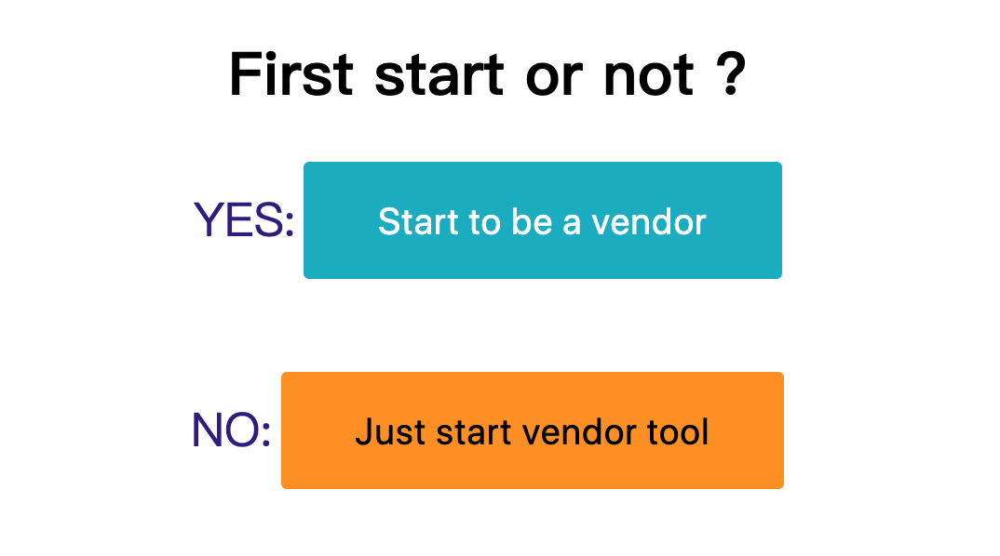
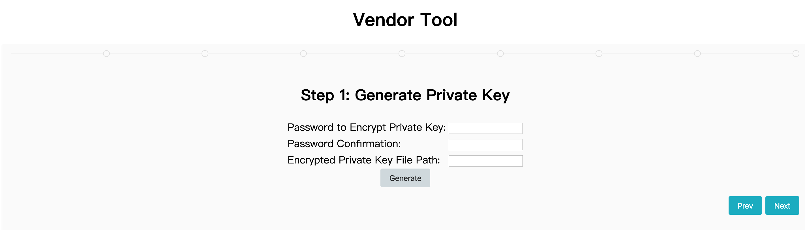
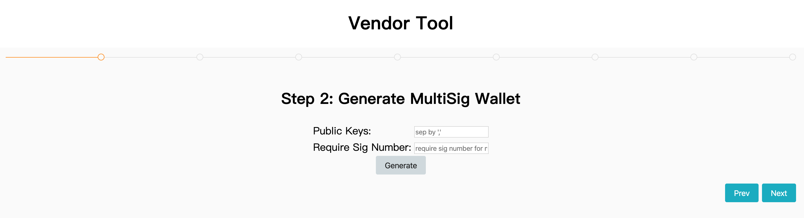
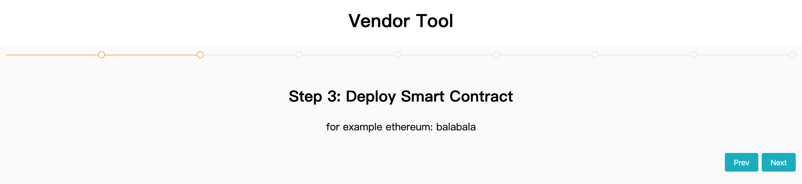
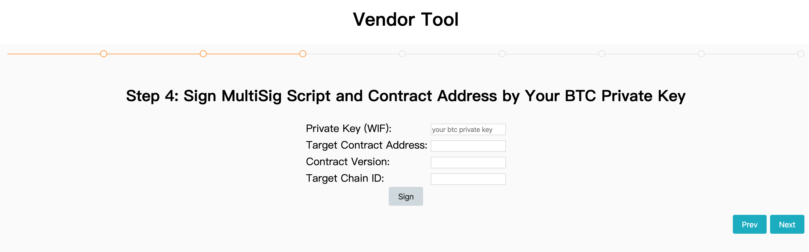
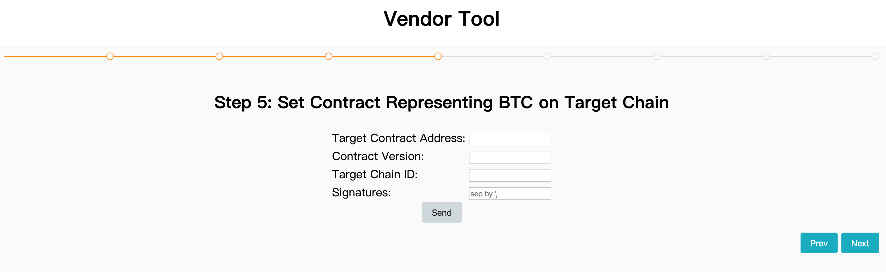
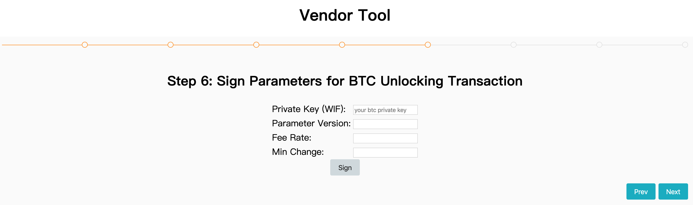
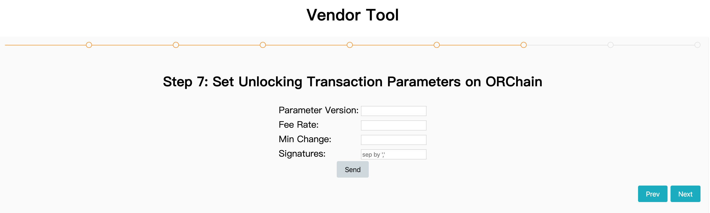
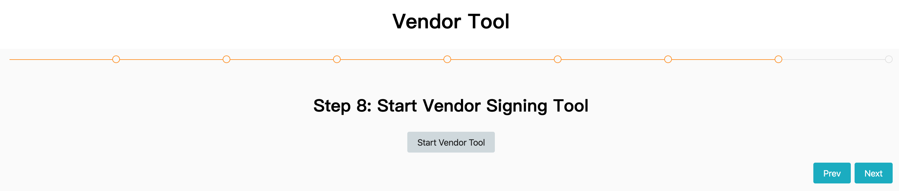

<h1 align="center">Vendor Tool</h1>
<h4 align="center">Version 1.0 </h4>

## 引言

​	Alice、Bob和Carl准备好了自己的比特币多签钱包和中继链钱包，正准备开展比特币跨链业务，可是发现他们缺少和中继链交互的工具，需要对中继链返回的交易进行签名，这时候他们就可以用到这个工具啦！

​	多签签名工具实现了对中继链的监听，会获取中继链返回的需要Alice他们签名的交易，他们每人都启动这样一个工具，监听到对应交易之后就使用自己的私钥自动化签名，这样比特币的跨链流程就完整了。

## 使用

配置信息和对应解释如下，Alice只需要准备好带“*”的配置即可。

```json
{
  "PolyJsonRpcAddress": "http://ip:40336", //中继链地址*
  "WalletFile": "/path/to/wallet.dat", //中继链钱包文件*
  "WalletPwd": "pwd", //中继链钱包密码*
  "BtcWalletPwd": "pwd", //比特币钱包密码，没有就不用设置*
  "PolyObLoopWaitTime": 2, //监听中继链的间隔时间
  "BtcPrivkFile": "/path/to/btcprivk", //比特币钱包路径，没有就不设置*
  "WatchingKeyToSign": "makeBtcTx", //监听关键字
  "ConfigBitcoinNet": "test", //比特币网络类型*
  "ConfigDBPath": "./db", //数据库路径
  "RestPort": 50071, //REST端口
  "SleepTime": 10, //网络阻塞等问题的重试时间
  "PolyNet": "testnet", //中继链网络类型
  "CircleToSaveHeight": 300, //每N个中继链高度本地记录一次
  "MaxReadSize": 5000000, //每次从数据库读取的最大字节数
  "Redeem": "your redeem in hex", //多签Redeem脚本的十六进制字符串，还没有生成就不用设置*
  "SignerAddr": "", //监听签名分离模式，签名的REST地址
  "ObServerAddr": "" //监听签名分离模式，监听的REST地址
}
```

在项目根目录下运行以下命令即可

```go
go build -o vendor ./cmd/run.go
```

对可执行文件需要的flag有：

| flag       | 解释                                                         |
| ---------- | ------------------------------------------------------------ |
| --loglevel | Set the log level to `<level>` (0~6). 0:Trace 1:Debug 2:Info 3:Warn 4:Error 5:Fatal 6:MaxLevel |
| --config   | 指定工具的配置文件                                           |
| --polypwd | Password of polygon wallet, you can also set in config file or input when start tool. |
| --btcpwd   | Password of encrypted btc private key, you can also set in config file or input when start tool. |
| --web      | Start web server or not, 1(Y), 0(N)                          |

启动工具：

```
./vendor --polypwd pwd --btcpwd pwd --config ./conf.json --loglevel 0 --web 1
```

启动之后，访问 http://localhost:8080 即可看到选择页面。选择直接启动工具，必须先完成配置conf.json，这意味你已经完成了多签的生成、合约绑定、参数设置等步骤，如果还没完成的话可以选择第一个选项。

<div align=center></div>

选择第一个“Start to be a vendor”，你会进入一个引导流程。

首先，生成自己的比特币私钥，并且设置密码生成一个比特币加密的钱包文件（钱包曲线和比特币不同），记下显示的信息。

<div align=center></div>

然后，收集Vendor所有人的公钥，依次输入，按逗号隔开，生成多签Redeem脚本。

<div align=center></div>

下面就完成目标链BTC代币合约的部署，完成对应的配置。

<div align=center></div>

接着就是为合约地址、多签、合约版本签名，版本从零开始以此递增，每次更新加一，得到签名记下来。

<div align=center></div>

然后收集签名，直到大于要求的签名数目，以此排列，输入到网页中，向ORChain网络发送交易注册合约，从此跨链到目标链上的BTC会被映射到该合约。

<div align=center></div>

同样地为参数进行签名，发送交易在ORChain上设置参数。

<div align=center></div>

<div align=center></div>

然后就可以启动工具。

<div align=center></div>

